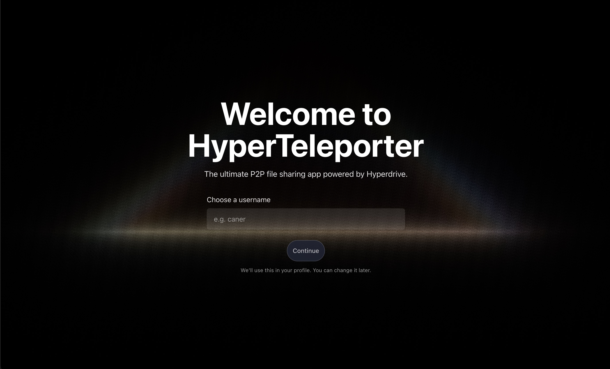
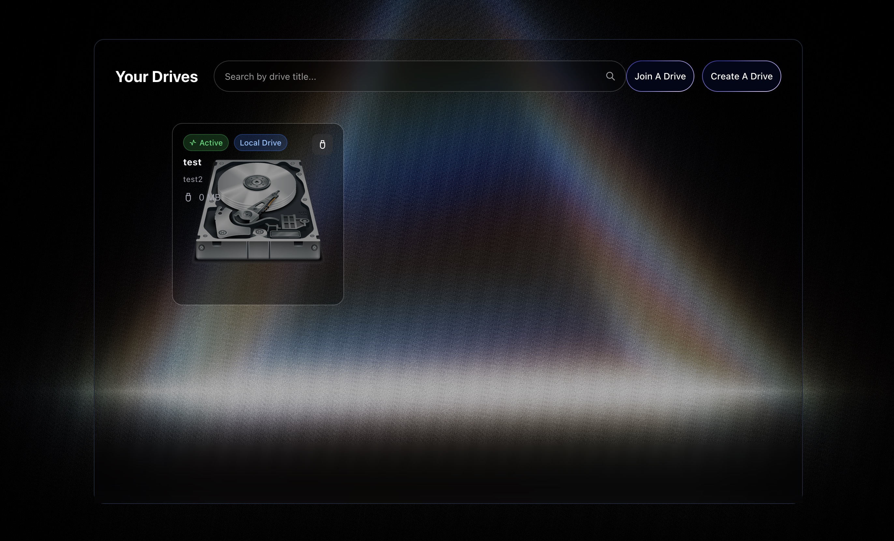
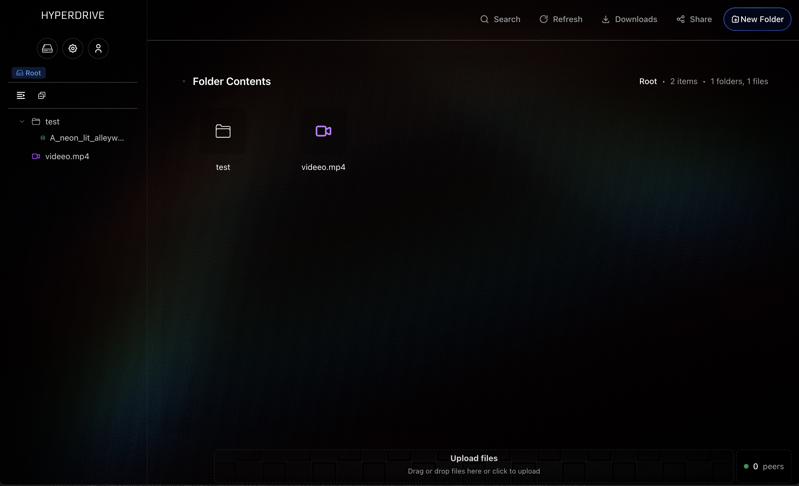
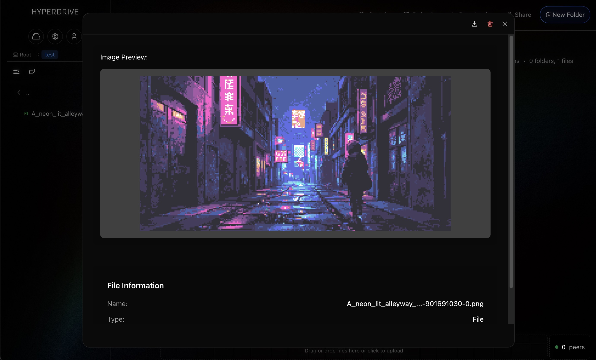

# HyperTeleporter 🚀

**The ultimate P2P file sharing app powered by Hyperdrive**

HyperTeleporter is a modern, secure, and decentralized file sharing application that allows you to create, share, and access files across devices without relying on centralized servers. Built with Electron, React, and TypeScript, it leverages the power of Hyperdrive for peer-to-peer file synchronization.



## ✨ Features

### 🔗 **Decentralized P2P Sharing**
- **No servers required** - Direct peer-to-peer connections
- **Secure by design** - End-to-end encryption with Hyperdrive
- **Real-time sync** - Files update instantly across all connected devices
- **Offline-first** - Works even when disconnected from the internet

### 📁 **Drive Management**
- **Create personal drives** - Set up your own file storage spaces
- **Join shared drives** - Access files shared by friends and colleagues
- **Organize with folders** - Full directory structure support
- **Search functionality** - Quickly find files across all your drives

### 🎨 **Modern Interface**
- **Beautiful UI** - Sleek, dark-themed interface with smooth animations
- **Drag & drop** - Intuitive file uploads
- **Context menus** - Right-click actions for file management
- **Responsive design** - Works perfectly on all screen sizes

### 🔒 **Privacy & Security**
- **Zero-knowledge architecture** - Your files never touch our servers
- **Cryptographic keys** - Each drive has unique encryption keys
- **Read-only access** - Control who can modify your shared content
- **Local storage** - All data stored securely on your device



## 🚀 Quick Start

### Installation

1. **Download** the latest release for your platform:
   - **Windows**: `hyperteleporter-1.0.0-setup.exe`
   - **macOS**: `hyperteleporter-1.0.0.dmg`
   - **Linux**: `hyperteleporter-1.0.0.AppImage`

2. **Install** the application following your platform's standard installation process

3. **Launch** HyperTeleporter and set up your username

### Creating Your First Drive

1. **Click "Create Drive"** on the main screen
2. **Enter a name** for your drive (e.g., "My Documents")
3. **Click "Create"** - your drive will be ready in seconds
4. **Start uploading** files by dragging them into the interface

### Sharing Files with Others

1. **Open your drive** and upload the files you want to share
2. **Click the "Share" button** to get your drive's public key
3. **Send the key** to your friends via any messaging platform
4. **They can join** your drive using the "Join Drive" feature



### Joining Someone Else's Drive

1. **Click "Join Drive"** on the main screen
2. **Enter a name** for the drive (how you want to see it)
3. **Paste the public key** provided by the drive owner
4. **Click "Join"** - you'll now have read-only access to their files

## 📖 Detailed Tutorial

### Step 1: Setting Up Your Profile
When you first launch HyperTeleporter, you'll be greeted with a beautiful welcome screen. Enter your username - this helps identify you when sharing drives with others.

### Step 2: Creating a Drive
- Navigate to the drives page
- Click the "Create Drive" button
- Give your drive a descriptive name
- Your drive is now ready for files!

### Step 3: File Management
- **Upload files**: Drag and drop files directly into the drive interface
- **Create folders**: Right-click in empty space and select "New Folder"
- **Organize**: Move files between folders using drag and drop
- **Delete files**: Right-click on files and select "Delete"

### Step 4: Sharing Your Drive
- Open the drive you want to share
- Click the "Share" button in the top toolbar
- Copy the generated public key
- Share this key with anyone you want to give access to

### Step 5: Joining Shared Drives
- Click "Join Drive" from the main interface
- Enter a name for the drive (how it will appear in your list)
- Paste the public key from the drive owner
- Click "Join" to start syncing



## 🛠️ Technical Details

### Built With
- **Electron** - Cross-platform desktop app framework
- **React** - Modern UI library with TypeScript
- **Hyperdrive** - Decentralized file system protocol
- **Hyperswarm** - P2P networking stack
- **Tailwind CSS** - Utility-first styling

### Architecture
- **Frontend**: React with TypeScript for type safety
- **Backend**: Electron main process with Node.js
- **Storage**: Local file system with Hyperdrive synchronization
- **Networking**: P2P connections via Hyperswarm DHT

### Security Model
- Each drive has a unique cryptographic key pair
- Files are encrypted using the drive's content key
- Only users with the public key can access the drive
- Private keys never leave your device

## 🔧 Development

### Prerequisites
- Node.js 18+ 
- pnpm package manager

### Setup
```bash
# Clone the repository
git clone https://github.com/executionreverted/hyperteleporter.git
cd hyperteleporter

# Install dependencies
pnpm install

# Start development server
pnpm dev
```

### Building
```bash
# Build for current platform
pnpm build

# Build for specific platforms
pnpm build:win    # Windows
pnpm build:mac    # macOS
pnpm build:linux  # Linux
```

## 📋 System Requirements

### Minimum Requirements
- **OS**: Windows 10, macOS 10.14, or Linux (Ubuntu 18.04+)
- **RAM**: 4GB
- **Storage**: 100MB for app + space for your files
- **Network**: Internet connection for P2P sync

### Recommended
- **RAM**: 8GB or more
- **Storage**: SSD with at least 1GB free space
- **Network**: Stable broadband connection

## 🤝 Contributing

We welcome contributions! Please see our [Contributing Guidelines](CONTRIBUTING.md) for details.

### Development Workflow
1. Fork the repository
2. Create a feature branch
3. Make your changes
4. Add tests if applicable
5. Submit a pull request

## 📄 License

This project is licensed under the MIT License - see the [LICENSE](LICENSE) file for details.

## 🆘 Support

### Getting Help
- **Issues**: Report bugs and request features on [GitHub Issues](https://github.com/executionreverted/hyperteleporter/issues)
- **Discussions**: Join community discussions on [GitHub Discussions](https://github.com/executionreverted/hyperteleporter/discussions)
- **Documentation**: Check our [Wiki](https://github.com/executionreverted/hyperteleporter/wiki) for detailed guides

### Common Issues
- **Drive not syncing**: Ensure both devices are online and have the correct public key
- **Files not appearing**: Check if the drive is still syncing (look for sync indicators)
- **Connection issues**: Verify your firewall allows P2P connections

## 🎯 Roadmap

### Upcoming Features
- [ ] **File versioning** - Track changes and restore previous versions
- [ ] **Selective sync** - Choose which folders to sync on each device
- [ ] **Mobile apps** - iOS and Android versions
- [ ] **Web interface** - Browser-based access
- [ ] **Team collaboration** - Multi-user drive management
- [ ] **File previews** - Built-in preview for common file types

### Recent Updates
- ✅ **v1.0.0** - Initial release with core P2P functionality
- ✅ **Cross-platform support** - Windows, macOS, and Linux
- ✅ **Modern UI** - Beautiful, responsive interface
- ✅ **File management** - Upload, organize, and share files

---

**Ready to experience the future of file sharing?** Download HyperTeleporter today and join the decentralized revolution! 🚀

[Download Now](https://github.com/executionreverted/hyperteleporter/releases/latest) | [View Source](https://github.com/executionreverted/hyperteleporter) | [Report Issue](https://github.com/executionreverted/hyperteleporter/issues)